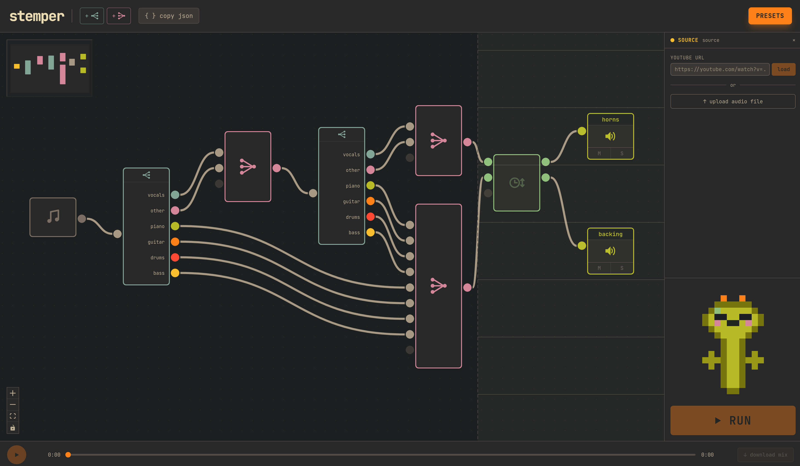

# Stemper

Visual audio stem separation with a node-graph editor. Paste a YouTube URL or
drop an audio file, run a Demucs-powered graph, and play back or export the
resulting stems.



## Features

- YouTube URL download (via yt-dlp) and direct audio-file upload.
- Demucs stem separation with three models: `htdemucs_6s` (6 stems),
  `htdemucs` (4 stems), and `htdemucs_ft` (fine-tuned 4 stems).
- Interactive node graph (React + xyflow) with five node types: Source,
  Split, Mix, Pitch/Speed, and Output.
- Built-in presets plus user-saved presets (persisted in localStorage,
  import/export as JSON).
- Multi-track synchronized playback with per-track mute and solo, drift
  compensation, and a scrubber.
- Mix download as WAV (M/S applied).
- Content-hashed per-job cache so pitch/tempo tweaks don't re-run Demucs.
- stem-mon, a clickable dancing pixel-art mascot.

## Architecture

```
 ┌──────────────────┐       HTTP + SSE       ┌──────────────────────┐
 │  Frontend        │ ─────────────────────▶ │  Backend             │
 │  Vite + React    │                        │  FastAPI + Uvicorn   │
 │  xyflow graph    │ ◀───────────────────── │  Demucs / torchaudio │
 │  Tailwind (Gruv) │      progress events   │  yt-dlp              │
 └──────────────────┘                        └──────────┬───────────┘
                                                        │
                                             content-hashed cache
                                             backend/data/<job_id>/
```

The frontend serializes the graph and POSTs it to the backend. The executor
runs each node on a worker thread, writing outputs to
`backend/data/<job_id>/graph/<hash>.wav`. Progress is streamed back over SSE.
Subsequent runs with the same inputs hit the cache.

## Requirements

- Python 3.11 (the build script defaults to a mise-managed interpreter at
  `~/.local/share/mise/installs/python/3.11/bin/python3.11`; override with
  `PYTHON_BIN`).
- Node 20+ and npm.
- A few GB of free disk for the cache (10 GB cap, LRU-swept).
- Optional: an NVIDIA GPU with CUDA 11.8. CPU works, just slower; the backend
  logs the device it picked on startup (`[stemper] Using device: cuda|cpu`).

## Install

```bash
# 1. Build the Python venv with PyTorch, Demucs, FastAPI, yt-dlp, etc.
scripts/build_venvs.sh

# 2. Install frontend deps.
cd frontend && npm install
```

## Run

```bash
./run.sh
```

Backend listens on `http://localhost:8000`, frontend dev server on
`http://localhost:5173`. `run.sh` sets `STEMPER_YTDLP_VERBOSE=1` so yt-dlp
prints extractor diagnostics to the terminal.

### Running the halves separately

Useful when iterating on one side with hot reload:

```bash
# Backend only
cd backend
../.venv/demucs/bin/python -m uvicorn main:app --reload --host 0.0.0.0 --port 8000

# Frontend only
cd frontend
npm run dev
```

## Using the app

1. Paste a YouTube URL or drop an audio file onto the upload zone.
2. Open the Presets modal and load a starting graph — or build one from
   scratch with the node palette.
3. Edit node parameters in the right-hand inspector (model, gain, pitch,
   tempo, …).
4. Click Run. Node progress streams into the canvas live.
5. Mute/solo, scrub, and listen. Download individual outputs, or export the
   mix as a single WAV.

## Presets

All presets funnel their outputs through a single Pitch/Speed node so tempo
and pitch apply to every stem without re-running the graph.

| Preset | What it does |
| --- | --- |
| `default_6stem` | Plain 6-stem Demucs split. |
| `vox_isolation_2pass` | Second pass over (vocals + other) to clean up leakage in the vocal stem. |
| `horns_vox_isolation_2pass` | Second pass over the "other" channel — useful for saxophone/brass. |
| `guitar_isolation_2pass` | Re-separate the guitar stem from pass 1. |
| `piano_isolation_2pass` | Re-separate the piano stem from pass 1. |
| `drums_isolation_2pass` | Re-separate the drums stem from pass 1. |

2-pass isolation works by mixing a target stem with its complement and
re-running Demucs on the mix, which tends to reassign leakage back to the
correct stem.

## Repo layout

```
backend/
  main.py            FastAPI app, jobs, graph runs, SSE
  graph/             schema, executor, cache, presets, node implementations
  util/              yt-dlp download, stem split, audio utilities
  data/<job_id>/     per-job download and content-hashed cache (gitignored)
frontend/
  src/graph/         GraphEditor, Inspector, usePlayback, presets, StemmonDancer
  public/stem-mon/   generated mascot frames (8 palettes)
requirements/demucs.txt
scripts/
  build_venvs.sh                builds the Demucs venv
  generate_stemmon_frames.py    regenerates stem-mon's SVG frames + palettes
run.sh
```

## API reference

| Method | Path | Purpose |
| --- | --- | --- |
| POST | `/api/jobs` | Create a job from a YouTube URL. |
| POST | `/api/jobs/upload` | Create a job from an uploaded audio file. |
| GET | `/api/jobs/{id}` | Fetch job snapshot (title, duration, status). |
| GET | `/api/jobs/{id}/events` | SSE stream of download + graph progress. |
| POST | `/api/jobs/{id}/graph` | Execute a graph on the job's source audio. |
| POST | `/api/jobs/{id}/graph/cancel` | Cooperatively cancel the running graph. |
| GET | `/api/jobs/{id}/graph/outputs/{node_id}` | Download an Output node's WAV. |
| GET | `/api/presets` | List built-in presets with their graphs. |
| GET | `/api/models` | List available Demucs models. |

## Caching and cleanup

- Every node writes its output to
  `backend/data/<job_id>/graph/<content-hash>.wav`. Reruns with identical
  inputs hit the cache, so tweaking pitch or tempo only re-runs the
  Pitch/Speed node.
- The cache is capped at 10 GB per job dir and swept LRU when it overflows.
  Cache hits touch the file's mtime so upstream stems stay warm.
- On backend startup, only the 5 most-recent job directories are kept; older
  ones are deleted wholesale (`MAX_JOB_DIRS_ON_DISK` in `backend/main.py`).

## Troubleshooting

- **"Demucs venv not found"** — run `scripts/build_venvs.sh` first. If your
  Python 3.11 lives elsewhere, set `PYTHON_BIN` to its absolute path.
- **No GPU detected** — the backend logs `[stemper] Using device: cpu` on
  startup. Everything still works, just slower.
- **Playback stutter** — `usePlayback` uses throttled drift-sync (400 ms
  check, ±3% nudge for small drift, hard seek past 500 ms). If a tab was
  backgrounded and woke up far behind, the next sync tick should snap it
  back.

## License

TODO — no license file in the repo yet.
